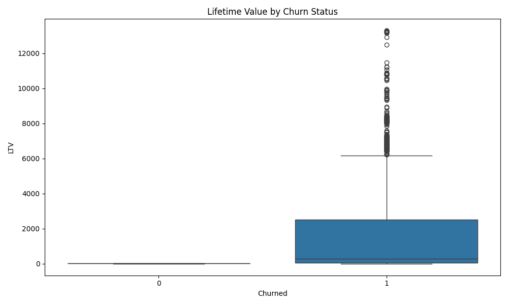

# 📊 Customer Churn & LTV Analytics Platform

An end-to-end solution to explore, engineer, and predict customer churn using a complete **SQL → Python → ML → Streamlit** pipeline.

Built for data scientists and analysts, this platform combines **modular SQL-based feature engineering**, Python-powered transformation, a **PyTorch prediction model**, and explainable AI (SHAP) – all accessible through an intuitive Streamlit dashboard.

---

## 🧱 Project Structure

```
.
├── datasets/
│   ├── csv-files/                 # Raw CRM & ERP data (bronze/silver/gold layers)
│   └── DataWarehouseAnalytics.bak # Backup of MySQL data warehouse
├── scripts/
│   ├── *.sql                      # Modular SQL scripts for feature engineering
│   ├── import_gold_to_mysql.py   # Load CSVs into MySQL
│   └── python_integration.py     # Feature generation, LTV calculation
├── features_customer_churn_ltv.csv # Final ML-ready dataset
├── churn_model.pt                # Trained PyTorch model
├── scaler.pkl                    # Scaler used for feature standardization
├── app.py                        # Streamlit dashboard (UI + ML + SHAP)
├── requirements.txt
└── README.md
```

---

## 🧠 Key Features

- 📐 **SQL-Driven Feature Engineering**
  - 14+ modular SQL scripts (segmentation, recency, churn logic, LTV metrics)
  - Data pipeline designed around a gold-layer warehouse schema
- 🧮 **Python Integration**
  - Transforms SQL features for ML usage
  - Applies standardization and saves model-ready features
- 🔮 **Churn Prediction**
  - PyTorch model trained with dropout + class balancing
  - Real-time prediction using 3 key inputs
- 🧩 **Explainable AI**
  - SHAP bar plots show how each input influenced the prediction
- 📊 **Streamlit Dashboard**
  - Interactive visuals
  - Filters + user-friendly prediction panel
  - Fully responsive UI

---

## 🚀 How to Run

### 1. Install dependencies
```bash
pip install -r requirements.txt
```

### 2. (Optional) Import CSVs into MySQL
```bash
python scripts/import_gold_to_mysql.py
```

### 3. Run Python Feature Generator
```bash
python scripts/python_integration.py
```

### 4. Train Model (if not using provided one)
```bash
python train_pytorch_model.py
```

### 5. Launch the Streamlit Dashboard
```bash
streamlit run app.py
```

---

## 🎯 Prediction Inputs

- 🛒 Order Count  
- 💰 Lifetime Value  
- 📆 Days Since Last Order

Each prediction is followed by a SHAP explanation plot.

---

## 📷 Sample Visual (Dashboard Preview)

> 

---

## 📚 Requirements

- Python 3.9+
- PyTorch
- Streamlit
- SHAP
- Pandas, Numpy, Matplotlib, Plotly
- (Optional) MySQL for SQL pipeline

---

## 👨‍💻 Created By

**Prudhvi Raj Rekula**  
Built with ❤️ using SQL, PyTorch, SHAP & Streamlit  
🔗 [GitHub Profile](https://github.com/Prudhvirajrekula)

---

## 📄 License

This project is open-source and free to use under the MIT License.
